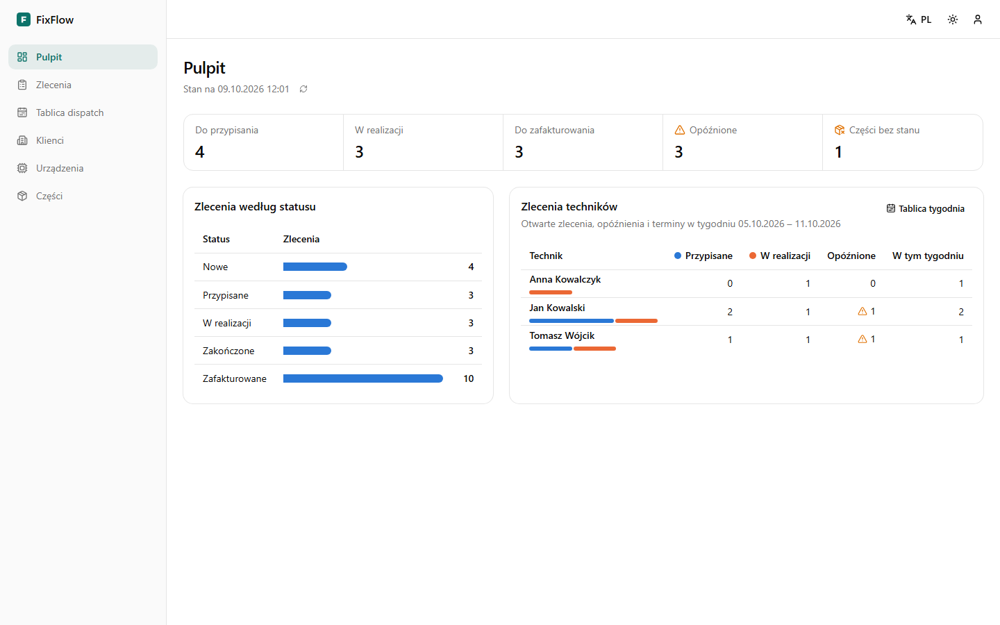
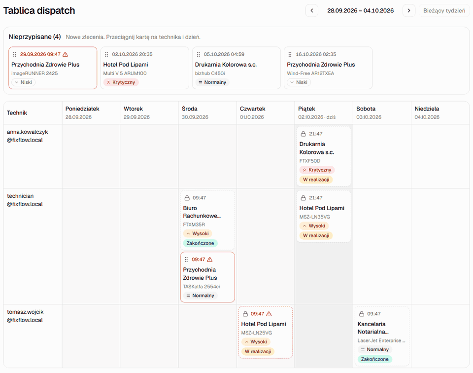
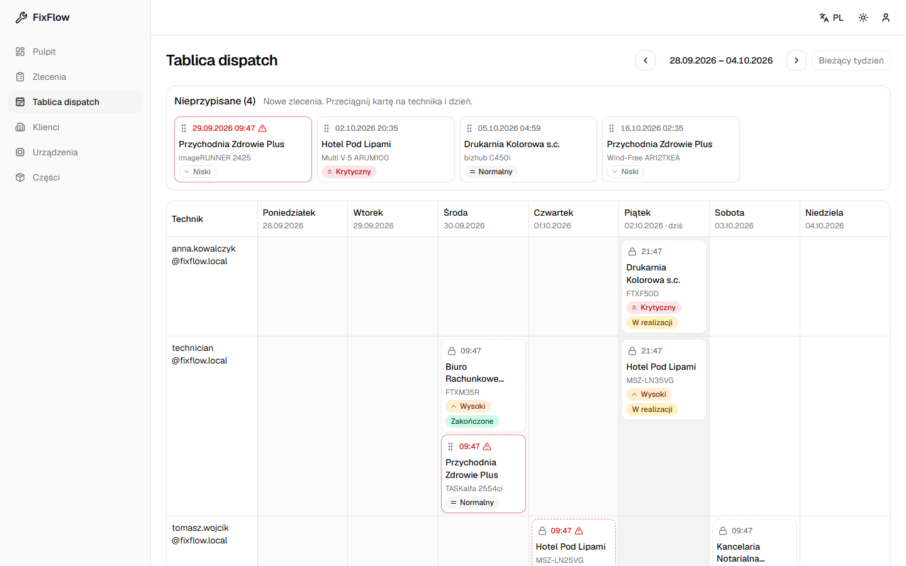
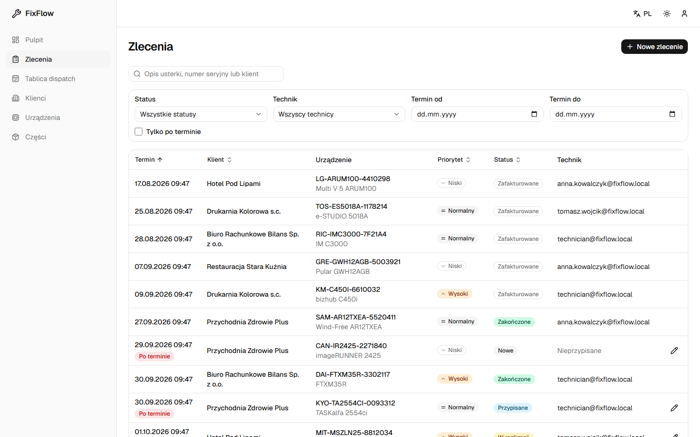
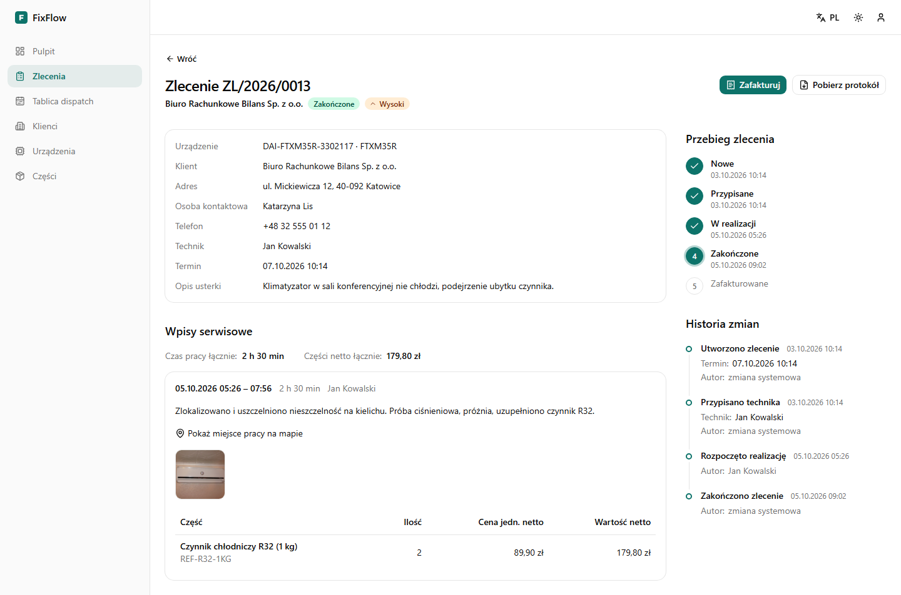
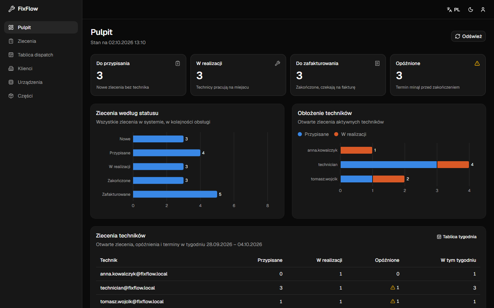
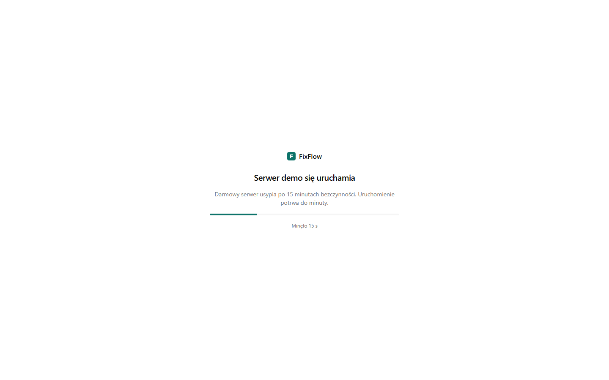

# FixFlow.Web

[](https://github.com/mpalus-git/FixFlow.Web/actions/workflows/ci.yml)

Działający panel: **[fix-flow-web.vercel.app](https://fix-flow-web.vercel.app)**

Na ekranie logowania są przyciski szybkiego logowania kontami demo dyspozytora i technika, więc nie trzeba znać haseł (są też jawne w [README FixFlow.Api](https://github.com/mpalus-git/FixFlow.Api#readme)). Kilka rzeczy, które warto wiedzieć przed pierwszym wejściem:

- API działa na darmowym planie Render i usypia po 15 minutach bezczynności. Pierwsze wejście może potrwać do minuty, a panel pokazuje w tym czasie ekran z postępem uruchamiania zamiast zablokowanego formularza.
- Dane demonstracyjne są wspólne dla wszystkich odwiedzających i są przywracane codziennie o 2:00 UTC.
- Konto administratora demo nie ma publicznego hasła. Widoki administratora (zarządzanie użytkownikami) są opisane niżej.

## Zrzuty ekranu

Pulpit z kolejkami zleceń wymagających uwagi i obłożeniem techników:



Tablica dispatch: tydzień w układzie technik x dzień, kolumna nieprzypisanych zleceń i przypisywanie przeciągnięciem (także z klawiatury):





Lista zleceń z filtrowaniem, sortowaniem i paginacją po stronie serwera, ze stanem zapisanym w adresie strony:



Szczegóły zlecenia: przebieg statusów, akcje zależne od roli i statusu, wpisy serwisowe z częściami w cenie z chwili zużycia i protokół PDF:



Tryb ciemny:



Ekran uruchamiania uśpionego serwera:



## Opis systemu

FixFlow to system obsługi zleceń serwisowych w terenie dla firmy naprawiającej klimatyzację i urządzenia biurowe. Składa się z trzech części:

- [FixFlow.Api](https://github.com/mpalus-git/FixFlow.Api) - backend ASP.NET Core z PostgreSQL, źródło prawdy dla reguł biznesowych i kontraktu OpenAPI.
- FixFlow.Web (to repozytorium) - panel webowy dla dyspozytora i administratora.
- Aplikacja mobilna technika (.NET MAUI) - powstanie osobno; technik rozpoczyna w niej pracę, dodaje wpisy serwisowe ze zdjęciami, lokalizacją GPS i zużytymi częściami oraz zamyka zlecenie.

Panel obsługuje trzy role:

| Rola | Co widzi i robi |
|---|---|
| Dispatcher | pulpit, zlecenia (tworzenie, edycja, przypisywanie, zakończenie awaryjne, fakturowanie), tablica dispatch, klienci, urządzenia, katalog części z przyjęciem dostawy |
| Admin | to samo co dyspozytor oraz zarządzanie użytkownikami: zakładanie kont z rolą, dezaktywacja, aktywacja, reset hasła |
| Technician | „Moje zlecenia” tylko do odczytu, ze szczegółami i wpisami serwisowymi; praca w terenie odbywa się w aplikacji mobilnej |

Zlecenie przechodzi przez statusy Nowe -> Przypisane -> W realizacji -> Zakończone -> Zafakturowane. Panel pokazuje tylko akcje dozwolone dla roli i bieżącego statusu, ale ostatnie słowo zawsze ma API.

## Stack

| Obszar | Technologie |
|---|---|
| Podstawa | React 19, TypeScript 7 (strict, `noUncheckedIndexedAccess`, `exactOptionalPropertyTypes`), Vite 8, Node.js 24, pnpm |
| Routing | React Router 8 w trybie data: trasy leniwe per obszar, loadery, ochrona tras przez middleware |
| Dane z API | openapi-typescript i openapi-fetch (typy generowane z kontraktu), TanStack Query 5 |
| Tabele | TanStack Table (paginacja, sortowanie i filtrowanie po stronie serwera) |
| Formularze | React Hook Form, Zod 4 |
| UI | Tailwind CSS 4, shadcn/ui (Radix), lucide-react, Sonner, Recharts, dnd-kit |
| Stan UI | Zustand (sesja, motyw) |
| Daty i języki | date-fns z @date-fns/tz (Europe/Warsaw), i18next (polski i angielski) |
| Jakość | ESLint 10 z typescript-eslint (reguły typowane), jsx-a11y, Prettier, własna reguła zakazu komentarzy |
| Testy | Vitest, React Testing Library, MSW, Playwright, axe-core |
| CI i wdrożenie | GitHub Actions, Vercel |

## Uruchomienie lokalne

Wymagany jest Node.js 24 i pnpm 12.

```bash
pnpm install
cp .env.example .env.local
```

### Z API na Render

W `.env.local` wystarczy ustawić adres API, do którego serwer deweloperski Vite przekieruje żądania `/api` i `/health` (dzięki temu lokalnie nie ma problemu z CORS):

```bash
API_PROXY_TARGET=https://fixflow-api-us2p.onrender.com
```

```bash
pnpm dev
```

Panel działa pod http://localhost:5173. Logowanie danymi kont demo z README API albo, po uzupełnieniu zmiennych `VITE_DEMO_*`, przyciskami szybkiego logowania.

### Z lokalnym API

Wymagany jest Docker. Repozytorium zawiera środowisko używane w testach e2e: publiczny obraz `ghcr.io/mpalus-git/fixflow.api` przypięty do konkretnego commita i PostgreSQL 18, z kontami i danymi demo tworzonymi przy starcie.

```bash
cp e2e/.env.example e2e/.env
pnpm e2e:up
```

W `e2e/.env` trzeba uzupełnić hasło bazy, klucz JWT (co najmniej 32 znaki) i hasła kont demo (co najmniej 8 znaków, wielka i mała litera, cyfra i znak specjalny). API startuje pod http://localhost:8080, a w `.env.local` ustawia się:

```bash
API_PROXY_TARGET=http://localhost:8080
```

Środowisko zatrzymuje i czyści `pnpm e2e:down`. Alternatywnie można uruchomić pełne środowisko z repozytorium API (`docker compose up --build`, z Redisem i Mailpitem).

### Skrypty

| Skrypt | Co robi |
|---|---|
| `pnpm dev` | serwer deweloperski |
| `pnpm build`, `pnpm preview` | build produkcyjny i jego podgląd |
| `pnpm lint` | ESLint i Prettier |
| `pnpm typecheck` | kontrola typów TypeScript 7 |
| `pnpm test` | testy jednostkowe i komponentów (Vitest) |
| `pnpm e2e` | testy e2e (Playwright) na lokalnym API |
| `pnpm check:comments` | zakaz komentarzy w CSS, HTML, YAML i tsconfig |
| `pnpm api:sync`, `pnpm api:types` | pobranie aktualnego kontraktu z repozytorium API i wygenerowanie typów |

## Architektura katalogów

Kod jest podzielony według funkcji. Obszar nie importuje z innego obszaru, wyjątkiem są komponenty wystawione w jego publicznym `index.ts` (np. karta klienta osadza listę urządzeń klienta).

```text
src/
  app/                 router, layout, obsługa błędów tras, middleware sesji, ekran budzenia serwera
  features/
    <obszar>/          auth, dashboard, work-orders, dispatch, clients, devices, parts, users, profile
      api/             zapytania i mutacje TanStack Query, fabryka kluczy zapytań
      components/
      pages/
      schemas/         schematy Zod formularzy
      hooks/
      index.ts         publiczne komponenty obszaru
  shared/
    api/               wygenerowany schema.ts, klient openapi-fetch, middleware auth i błędów, mapowanie ProblemDetails
    session/           tokeny, odświeżanie single-flight, synchronizacja kart
    ui/                komponenty shadcn/ui i własne komponenty wspólne
    lib/               daty i strefa czasowa, kwoty, walidacja, helpery
    i18n/              konfiguracja i tłumaczenia pl.json, en.json
    theme/             motyw jasny, ciemny i systemowy
e2e/                   testy Playwright, compose.yaml z obrazem API
openapi/               kopia kontraktu FixFlow.Api
scripts/               synchronizacja kontraktu, generowanie typów, kontrola komentarzy
```
